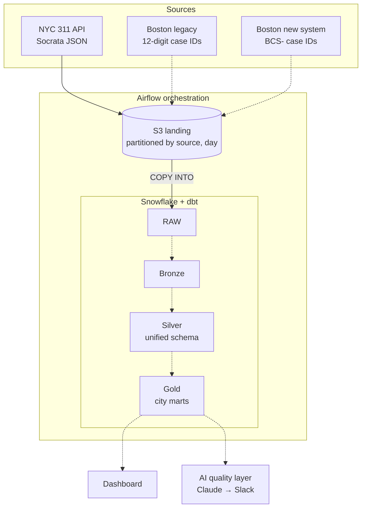

# City 311 Data Pipeline

End-to-end data engineering pipeline on 311 service request data from New York City and Boston.

**Stack:** Airflow · AWS S3 · Snowflake · dbt · Claude (AI data-quality layer)

## Architecture

Solid arrows are built; dotted arrows are planned.

## Progress
- [x] Phase 1a: Snowflake warehouse, database, raw table
- [x] Phase 1b: S3 storage integration + external stage (IAM role, least privilege)
- [x] Phase 1c: First load: 1,000 records via COPY INTO
- [x] Phase 1d: Airflow DAG: daily extract from 311 API to S3 (NYC-local day partitions, idempotent)
- [x] Phase 1e: Airflow load task (S3 → Snowflake COPY INTO) via key-pair service user
- [ ] Phase 2: dbt medallion layers
- [ ] Phase 3: Testing
- [ ] Phase 4: AI incident summaries
- [ ] Phase 5: Dashboard

## Setup
Replace placeholders (`<AWS_ACCOUNT_ID>`, `<YOUR_BUCKET>`, etc.) with your own values.
Run the files in `snowflake/` in order.
